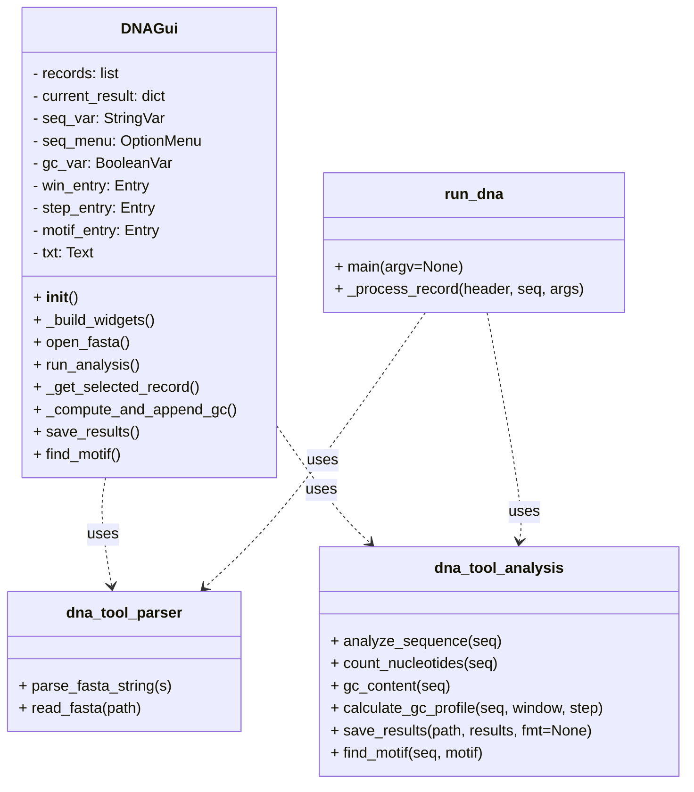

# Arkkitehtuuri

Seuraava kaavio kuvaa sovelluksen pääluokat ja niiden suhteet (+ = public ja - = private):

## Korkean tason rakenne

Projektin hakemistorakenne on jaettu selkeisiin vastuualueisiin:

- `src/`
  - `dna_tool/` — ydinlogiikka: parserit ja analyysit (esim. `parser.py`, `analysis.py`, `storage.py`)
  - `gui.py` — Tkinter-pohjainen käyttöliittymä
  - `run_dna.py` — komentorivityökalu ja ajoskriptit
- `tests/` — yksikkö- ja integraatiotestit
- `dokumentaatio/` — suunnittelu- ja arkkitehtuuridokumentit
- `laskarit/` — harjoitustyöhön liittyvät tehtävät

## Sovelluslogiikan kulku

1. Käyttäjä valitsee FASTA-tiedoston GUI:ssa tai CLI:llä.
2. Parseri (`dna_tool.parser`) lukee ja palauttaa sekvenssit (header + sekvenssi).
3. Jokainen sekvenssi syötetään analyysikomponentille (`dna_tool.analysis`), joka laskee:
   - pituuden, nukleotidien lukumäärät
   - GC-prosentin (kokonais- ja ikkuna-analyysi)
   - mahdolliset motifin esiintymät (kasautuvat/overlapping hyväksyen)
4. Tulokset palautetaan kutsujalle (GUI tai CLI) sanakirjana ja voidaan:
   - näyttää ruudulla (`gui.py`) tekstinä ja yksityiskohtaisina näkyminä
   - tallentaa JSON/CSV-muodossa tai vaihtoehtoisesti SQLite-tietokantaan

## Testaus

- Testit sijaitsevat `tests/`-kansiossa ja sisältävät sekä yksikkötestejä `dna_tool`-funktioille että mockattuja GUI-testejä, jotka korvaavat Tkinterin dialogit.

## Heikkoudet

- Pysyvä tallennus: Vaikka tulokset voidaan tallentaa JSON/CSV-muotoon, projektiin ei ole oletuksena integroitu relaatiotietokantaa tai muuta pysyvää tallennusratkaisua.
- GUI-rajoitteet: Tkinter-pohjainen käyttöliittymä on yksinkertainen ja sopii pienen mittakaavan käyttötapauksiin, mutta se voi olla kankea monimutkaisten näkymien tai suurten datamäärien kanssa.

