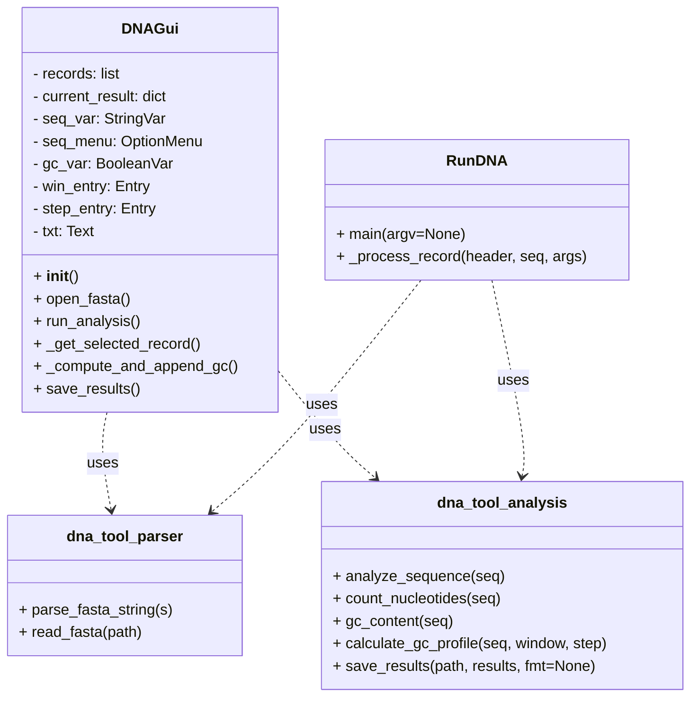

# Arkkitehtuuri

Seuraava kaavio kuvaa sovelluksen pääluokat ja niiden suhteet (+ = public ja - = private):

```mermaid
classDiagram
class dna_tool_parser {
  + parse_fasta_string(s)
  + read_fasta(path)
}

class dna_tool_analysis {
  + analyze_sequence(seq)
  + count_nucleotides(seq)
  + gc_content(seq)
  + calculate_gc_profile(seq, window, step)
  + save_results(path, results, fmt=None)
}

class DNAGui {
  - records: list
  - current_result: dict
  - seq_var: StringVar
  - seq_menu: OptionMenu
  - gc_var: BooleanVar
  - win_entry: Entry
  - step_entry: Entry
  - txt: Text
  + __init__()
  + open_fasta()
  + run_analysis()
  + _get_selected_record()
  + _compute_and_append_gc()
  + save_results()
}

class RunDNA {
  + main(argv=None)
  + _process_record(header, seq, args)
}

DNAGui ..> dna_tool_parser : uses
DNAGui ..> dna_tool_analysis : uses
RunDNA ..> dna_tool_parser : uses
RunDNA ..> dna_tool_analysis : uses

```
