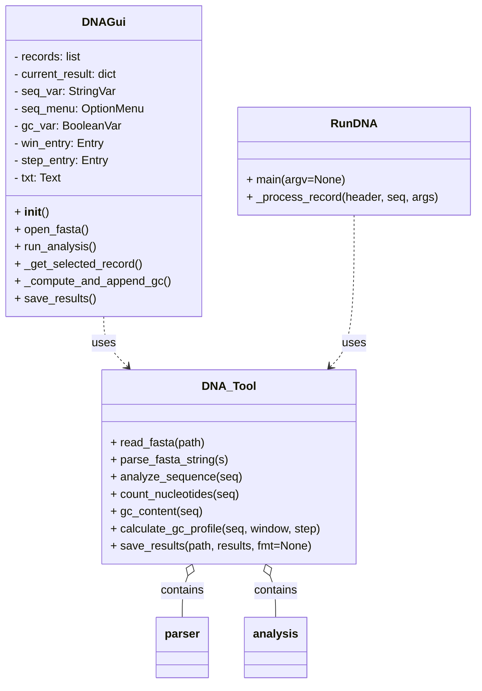

# Arkkitehtuuri

Seuraava kaavio kuvaa sovelluksen pääluokat ja niiden suhteet:

Kaavion perusteella `DNAGui` käyttää `DNA_Tool`-moduulia lukemaan FASTA-tiedostoja ja analysoimaan sekvenssejä. `RunDNA` on komentorivikäyttöliittymän päälogiikka, joka kutsuu samoja analysisyökaluja.
